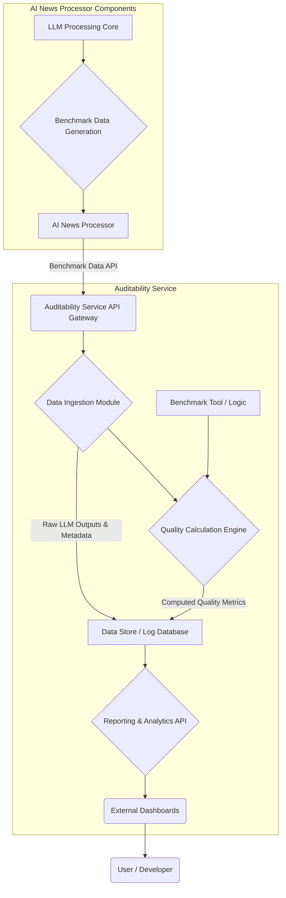

# LLM Output Auditability Service

## Objective

The primary objective of this service is to provide enhanced observability into the outputs generated by the Large Language Models (LLMs) within the AI News Processor. This will enable continuous monitoring and assessment of the quality and accuracy of generated content, particularly summaries.

## Core Functionality

1.  **Benchmark Data Consumption**: The service will ingest benchmark data produced by the AI News Processor.
2.  **Continuous Logging**: It will maintain a running log of LLM outputs.
3.  **Quality Calculation**: The service will incorporate or adapt the existing benchmark tool to continuously calculate quality metrics for the LLM outputs.
4.  **Accuracy Assessment**: By analyzing the quality metrics, the service will help determine the accuracy of the generated summaries.
5.  **Corrective Action Identification**: The insights from this service will inform decisions on whether corrective actions or fine-tuning of the LLMs or prompts are necessary.

## Desired Outcomes

*   Improved understanding of LLM performance over time.
*   Early detection of degradation in output quality.
*   Data-driven insights for LLM and prompt optimization.
*   Increased confidence in the reliability of the AI News Processor's outputs. 

## Proposed Architecture

Below is a potential high-level architecture for the LLM Output Auditability Service:

**Components:**

1.  **AI News Processor (AINP):**
    *   **Benchmark Data API / Client**: The AINP will be responsible for initiating the data transfer. At the end of a processing run, it will push persona-specific benchmark data (LLM inputs, outputs, reference texts, persona identifier, etc.) to the Auditability Service's API. The persona information is crucial for temporal stability analysis.

2.  **Auditability Service (AS) (Potentially a separate microservice):**
    *   **API Gateway**: Entry point for incoming data from AINP and outgoing queries for the AS UI.
    *   **Data Ingestion Module**: Receives benchmark data pushed from the AINP. It validates and prepares this data for storage.
    *   **Data Store / Log Database**: A persistent storage solution (e.g., a time-series database like Prometheus or InfluxDB, or a document database like Elasticsearch/OpenSearch) to store:
        *   Historical, persona-specific LLM outputs and their corresponding benchmark scores/data.
        *   Associated metadata (timestamps, model versions, persona identifier, input IDs).
        *   Calculated quality scores, linked to the original benchmark data.
    *   **Quality Calculation Engine**: This component operates asynchronously. Sometime after data ingestion, it will:
        *   Adapt or integrate the logic from the existing benchmark tool.
        *   Process new LLM outputs from the Data Store that haven't been analyzed.
        *   Calculate relevant quality metrics (e.g., ROUGE, BERTScore, semantic similarity, custom metrics).
        *   Store these metrics back in the Data Store, associating them with the corresponding benchmark entries.
    *   **Benchmark Tool / Logic**: The core algorithms and methods used for quality assessment, potentially refactored from the current AINP's benchmark tool for reusability within the AS.
    *   **Reporting & Analytics API / UI Backend**: An API to serve the stored data and calculated metrics to the Auditability Service's own User Interface (AS UI).
        *   The AS UI will allow users to view trends, compare persona performance, and analyze quality scores.

3.  **Auditability Service UI (AS UI)**: A web interface that consumes data from the Reporting & Analytics API to provide visual insights, dashboards, and potentially alerting mechanisms to users/developers.

**Data Flow:**

1.  At the end of a processing run, the AI News Processor (AINP) gathers persona-specific benchmark data (including the LLM inputs, generated outputs, reference material, and the persona identifier).
2.  The AINP makes an API call (pushes) to the Auditability Service (AS) API Gateway, sending this benchmark data.
3.  The AS Data Ingestion Module receives the data, validates it, and stores the persona-specific benchmark scores and associated metadata in the Data Store.
4.  At a later, scheduled time, or triggered by a different mechanism, the AS Quality Calculation Engine queries the Data Store for benchmark entries that have not yet had quality scores calculated.
5.  Using the integrated Benchmark Tool logic, it calculates quality scores for these entries.
6.  These calculated quality scores are then stored back into the Data Store, linked to their original benchmark data.
7.  Users/Developers can access the Auditability Service UI (AS UI), which queries the Reporting & Analytics API to display the benchmark data, quality scores, performance trends, and other insights.

**External Dashboards / Alerting**: Systems that consume data from the Reporting & Analytics API to provide visual insights and notifications to users/developers.

**Data Flow:**

1.  The AI News Processor generates LLM outputs and corresponding benchmark data.
2.  The AINP makes a request to the  Auditability Service's Data Ingestion API
3.  Raw outputs and metadata are stored in the Data Store.
4.  The Quality Calculation Engine processes the new entries, using the Benchmark Tool logic, and computes quality scores.
5.  Calculated scores are also stored in the Data Store.
6.  Users/Developers can query the Reporting & Analytics API or view dashboards to monitor LLM performance and output quality. 